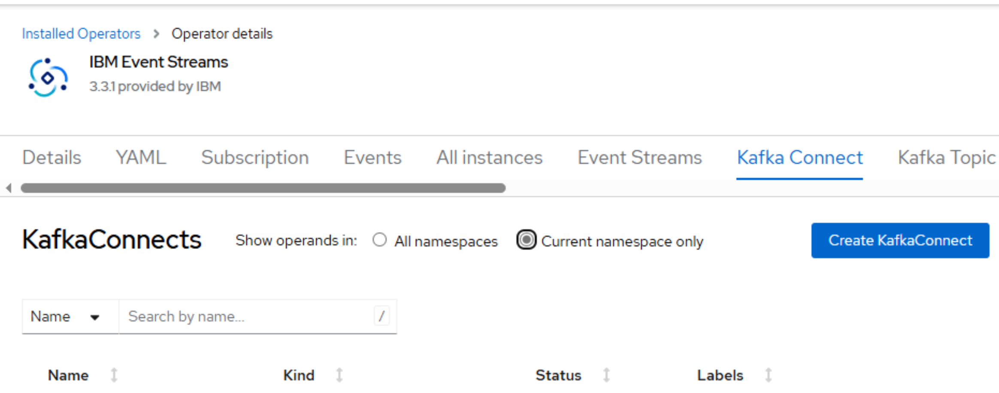
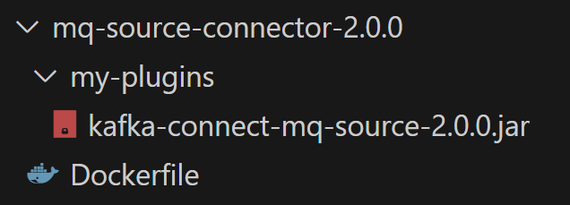
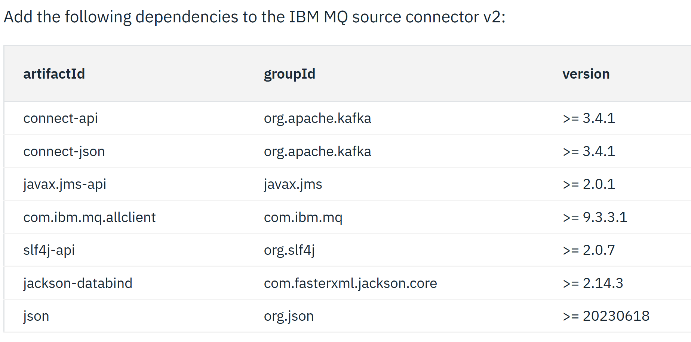
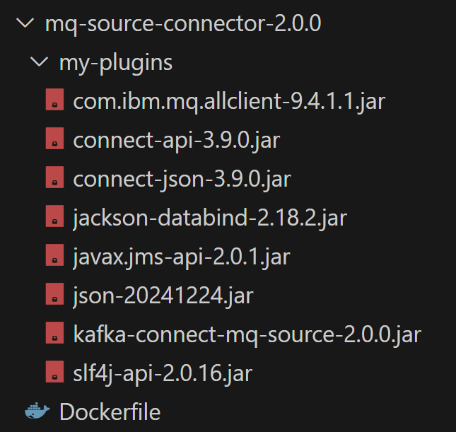
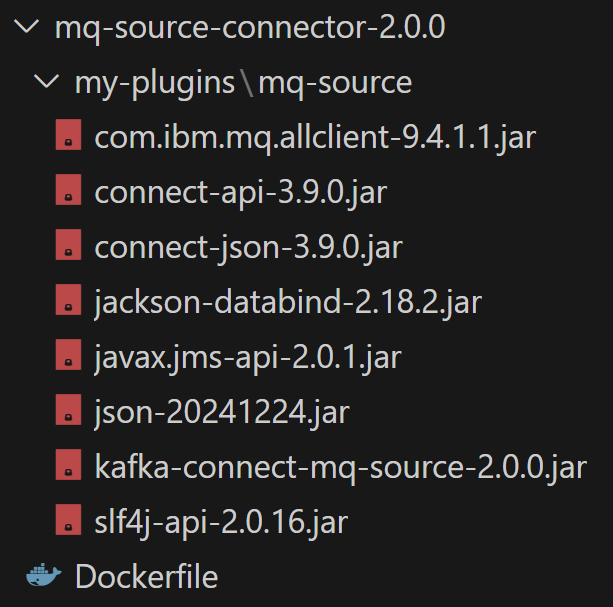
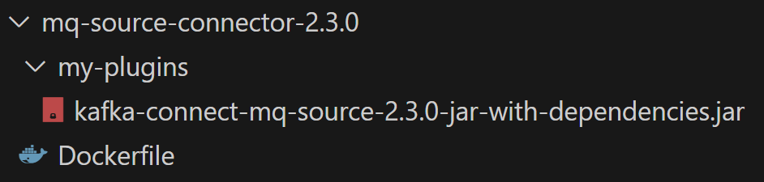

# Create your first Kafka Connect runtime for an IBM MQ source connector

Last updated: 16 March 2025

This post contains the steps to create your first Kafka Connect runtime.

This runtime implements the IBM MQ source connector.

The full IBM documentation can be found at [Install an IBM MQ **source** connector](https://ibm.github.io/event-automation/connectors/kc-source-ibm-mq/installation).

# Reason for writing this post

While I find the IBM documentation perfect as reference when you have solid understanding of IBM Event Streams, I found it challenging the first time I created a Kafka Connect runtime with an associated Kafka 'source' Connector for IBM MQ.

This guide attempts to add some clarity to the page - details that weren't clear to me while I was learning. It also describes my learning journey including problems I faced, perhaps related to my habit of not reading documentation thouroughly enough.

# Prerequisites

Ensure [IBM Event Streams](https://www.ibm.com/products/event-streams) has been installed in OpenShift and available in your namespace.

# How to check whether IBM Event Streams is available to your namespace

Log into the OpenShift console.

Select Installed Operators.

Search for IBM Event Streams. If this is found, you're ready to go.

If you click on IBM Event Streams, you'll see many tabs. The two tabs we are interested in are:

### Kafka Connect

### Kafka Connector

## Handy URLs

Prior to starting, I suggest you have a quick scan of the [handy URLs](../_posts/2025-03-16-es-mq-connector-handy-url.md) post.

 This post contains a list of URLs I found most useful while creating my first Kafka Connect runtime and associated IBM MQ source connectors.

# Let's go

There's essentially 3 steps:

- Build the Kafka Connect image

- Deploy the Kafka Connect runtime

- Deploy the Kafka Connector

The most useful URL I found was [Install an IBM MQ **source** connector](https://ibm.github.io/event-automation/connectors/kc-source-ibm-mq/installation).

## Build the Kafka Connect image

### My difficulties at the start

Perhaps the easiest yet most challenging step for me the 'first' time was to build the Kafka Connect image.

Why I hear you say!

For whatever reason, I had a difficult time finding the location to download the **kafka-connect-mq-source-n.n.n.jar** file.

*The n.n.n refers to the connection jar version.*

Eventually I found a compiled version (kafka-connect-mq-source-2.0.0.jar) could be downlaoded from [IBM Fix Central](https://www.ibm.com/support/fixcentral/swg/selectFixes?parent=ibm%7EOther%20software&product=ibm/Other+software/IBM+Event+Automation&release=1.0.0.0&platform=All&function=all) so long as your IBM ID had an entitlement to download the connector jar files.

This URL has a comment "*Kafka Connect MQ Source old version. For new version visit https://ibm.github.io/event-automation/connectors/kc-source-ibm-mq/installation*".

Later, I discovered IBM is posting the compiled [Kafka Connect mq source connector](https://github.com/ibm-messaging/kafka-connect-mq-source/releases/) (kafka-connect-mq-source-2.3.0.jar) open source versions to github.com - lucky that my company policy blocks downloads from github.com!

I was informed by my local rep that IBM will provide support if we face problems - we have enterprise support for IBM Event Streams. I'm not sure how the open source support works but I do see the [license](https://ibm.github.io/event-automation/connectors/kc-source-ibm-mq/Licensing%20and%20support) is the **Apache License 2.0** and I do see a "raise issue" link.

Early on I started with the **kafka-connect-mq-source-2.0.0.jar** file. In my wisdom, when I [created the image](https://ibm.github.io/event-automation/es/connecting/setting-up-connectors/#manually-add-required-connectors), I didn't add the [dependencies](https://ibm.github.io/event-automation/es/es_11.4/connecting/mq/source/#adding-connector-dependencies). I have a bad habit of not fully reading documentation. I didn't realize they were all missing from the kafka-connect-mq-source-2.0.0.jar file. Considering in the kafka-connect-mq-source-2.3.0.jar files IBM have provided a jar containg all the dependencies I suspect I'm not the only one!

The following shows the build files missing the dependencies.

When I deployed my Kafka Connect runtime with a Kafka Connector I got a class not found exception. I had no idea why.

Eventually, after assistance, I realized I needed to add the [dependencies](https://ibm.github.io/event-automation/es/es_11.4/connecting/mq/source/#adding-connector-dependencies).

You cannot imagine the pain I went through trying to locate the dependencies. I found the URL, didn't bookmark it, and could never locate it again. Eventually I realized why. I found the dependencies on the Event Streams 11.4 post, but when I came back later, the version had changed to 11.6. The 11.6 page doesn't list the dependencies as IBM now provides jar files containg the depenencies. The default IBM page lists the latest version, which at the time had changed from 11.4 to 11.6.

You can download the dependencies from maven central. If you're like me and not a developer, you may find the below helpful.

| artifactId | groupId | version | Maven Central |
| :--- | :--- | :--- | :--- |
| connect-api | org.apache.kafka | >= 3.4.1 | https://mvnrepository.com/artifact/org.apache.kafka/connect-api |
| connect-json | org.apache.kafka | >= 3.4.1 | https://mvnrepository.com/artifact/org.apache.kafka/connect-json |
| javax.jms-api | javax.jms | >= 2.0.1 | https://mvnrepository.com/artifact/javax.jms/javax.jms-api |
| com.ibm.mq.allclient | com.ibm.mq | >= 9.3.3.1 | https://mvnrepository.com/artifact/com.ibm.mq/com.ibm.mq.allclient |
| slf4j-api | org.slf4j | >= 2.0.7 | https://mvnrepository.com/artifact/org.slf4j/slf4j-api |
| jackson-databind | com.fasterxml.jackson.core | >= 2.14.3 | https://mvnrepository.com/artifact/com.fasterxml.jackson.core/jackson-databind |
| json | org.json | >= 20230618 | https://mvnrepository.com/artifact/org.json/json |

The next mistake I made was placing all the jars in the my-plugins directory and not a sub-directory. The [manually add required connectors](https://ibm.github.io/event-automation/es/connecting/setting-up-connectors/#manually-add-required-connectors) clearly states the requirements when multiple jar files are involved, but I managed to miss these details.

I rebuilt the image and still got an error.

Eventually I got the structure correct, rebuilt the image and all was ok.

Thankfully, with the [latest connector](https://github.com/ibm-messaging/kafka-connect-mq-source/releases/) (at the time or writing), IBM have provided multiple jar files, one containing all the dependencies.

Be aware, the below links start a download.

- [kafka-connect-mq-source-2.3.0-dependencies-exc-mq.jar](https://github.com/ibm-messaging/kafka-connect-mq-source/releases/download/v2.3.0/kafka-connect-mq-source-2.3.0-dependencies-exc-mq.jar)

- [kafka-connect-mq-source-2.3.0-jar-with-dependencies.jar](https://github.com/ibm-messaging/kafka-connect-mq-source/releases/download/v2.3.0/kafka-connect-mq-source-2.3.0-jar-with-dependencies.jar)

- [kafka-connect-mq-source-2.3.0.jar](https://github.com/ibm-messaging/kafka-connect-mq-source/releases/download/v2.3.0/kafka-connect-mq-source-2.3.0.jar) (no dependencies)

For the kafka-connect-mq-source-2.3.0 file, I built the image using the following structure.

## Create the Kafka Connect runtime

Create the Kafka Connect runtime in OpenShift.

==============

 As it turned out this jar file is missing the dependencies.

You can download the dependencies from maven or from the IBM MQ support page

Fortunately, the later files **kafka-connect-mq-source-2.3.0-jar-with-dependencies.jar** contain the dependencies.

