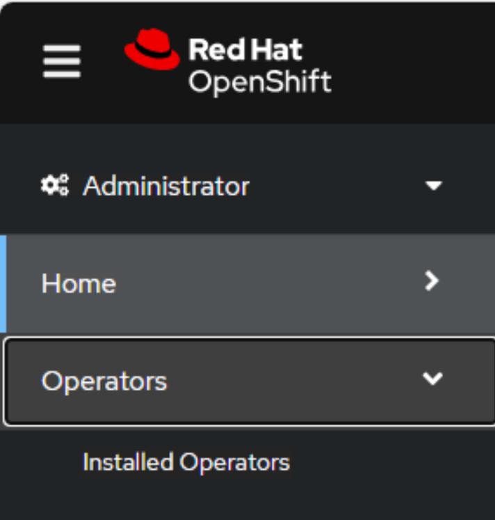
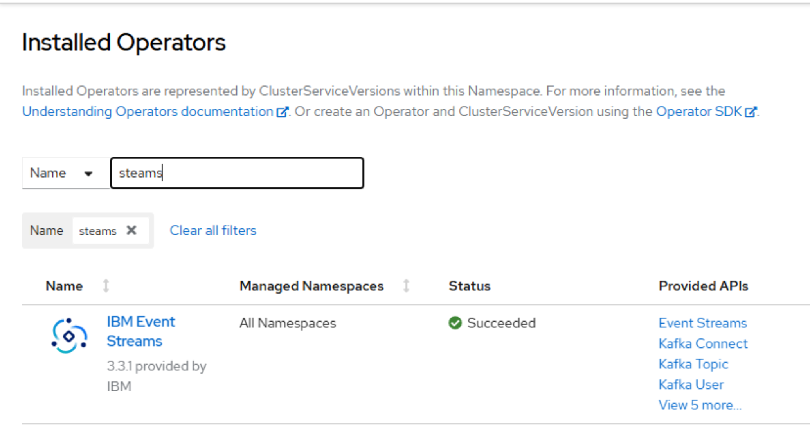
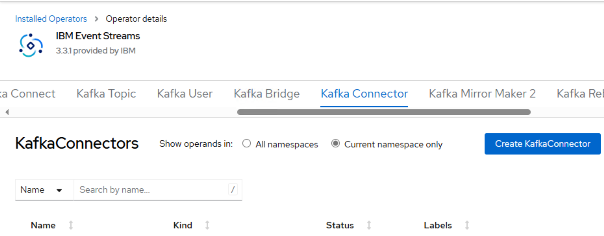

# How to stop, pause and start a Kafka MQ source connector


in progres


Last updated: 27 March 2025

This is a quick post to show how to stop, pause and start a Kafka MQ source connector.

The following operations are available to manage a Kafka MQ source connector.

```
state: running
state: paused
state: stopped
```

# state: running

As the name suggests, setting the state to running (the default) starts the Kafka MQ source connector.

# state: paused

Setting the state to paused keeps the Kafka MQ source connector running, but no further messages will be read from the IBM MQ queue.

# state: stopped

Setting the state to stopped stops the Kafka MQ source connector. In this state, you will see the input handles on the IBM MQ queue go from 1 to zero.

# Sample Kafka MQ source connector yaml file listing the operations

The below yaml file lists the states with the current state set as running.

To change the state, comment the running and uncomment the state you want.

``` yaml
apiversion: eventstreams.ibm.com/vibeta2
kind: KafkaConnector
metadata:
  :
spec:
  class: com.ibm.eventstreams.connect.mqsource.MQSourceConnector
  config:
    mq.queue.manager: MY_QMGR
    :
    # You can control the state of the connecter with the below vallues.
  state: running
  #state: paused
  #state: stopped
```

# Activate the state

There are many ways you can change the state.

## Change using the OpenShift console

Log into the OpenShift console.

Select Installed Operators.



Search for IBM Event Streams. If this is found, you're ready to go.



If you click on IBM Event Streams, you'll see many tabs.

Select the Kafka Connector tab.



Select the connector you'd like to work with.

Click on yaml to open the yaml file.

Locate the state keyword and change the status to the value you'd like to set it to. For example, stopped.

If you cannot locate the state keyword, you'll need to add it. It is perhaps easier to use the OC CLI.

## Change using the OpenShift OC CLI

Log into the server where you have the OC CLI installed. The following assumes unix.

I actually find using the OC CLI easier to use so I prefer this option.

### Log in to OpenShift

Log into OpenShift using the OC CLI.

``` sh
oc login -u YOUR_USER_ID --server=https://OPENSHIFT_URL:OPENSHIFT_PORT
```

``` sh
oc login -u sean --server=https://api.crc.testing:6443
```

### Select the correct project

List the projects.

``` sh
oc projects
```

```
/home/sean>oc projects
You have access to the following projects and can switch between them with ' project <projectname>':

  * my-kafka-dev
    my-kafka-qc

Using project "my-kafka-dev" on server "https://api.crc.testing:6443".
```

If you are not on the correct project (the one with the '*'), select it.

``` sh
oc project my-kafka-qc
```

``` sh
/home/sean>oc project my-kafka-qc
Now using project "my-kafka-qc" on server "https://api.crc.testing:6443".
```

### Change the state using the Kafka MQ source connector yaml file

If you have access to the Kafka MQ source connector yaml file, you can edit this and apply the changes.

Let's say you have a yaml file named kc-mq.yaml.

``` yaml
apiversion: eventstreams.ibm.com/vibeta2
kind: KafkaConnector
metadata:
  # Set the Kafka Connector name.
  # This name appears in the Kafka Connector tab of the Event Streams Operator.
  name: my-kafka-connector-name-01
  labels:
    # Set the the same value as "eventstreams.ibm.com/cluster" from the Kafka Connect yaml file.
    eventstreams.ibm.com/cluster: my-kafka-connect-01
spec:
  class: com.ibm.eventstreams.connect.mqsource.MQSourceConnector
  # For 'exactly once' messaging, to avoid duplicates, the value must be set to 1.
  #tasksMax: 1
  # Optionally add the autoRestarts setting to handle recovery situations.
  #autoRestart:
  #  enabled: true
  #  maxRestarts: 10
  config:
    # For exactly-once messaging, set the state queue name.
    # Define this queue as PERSISTENT with DEFSOPT(EXCL).
    # mq.exactly.once.state.queue: MY_STATE_QUEUE_NAME
    mq.queue.manager: MY_QMGR
    mq.connection.name.list: 10.1.1.1(1414)
    # For exactly-once messaging, set the HBINT(30) on the MQ channel name.
    mq.channel.name: MY_SVRCONN_CHANNEL
    mq.queue: MY_QUEUE_TO_GET_MESSAGES_FROM
    mq.user.name: ""
    mq.password: ""
    topic: MY-KAFKA-TOPIC-NAME
    mq.connection.mode: client
    mq.record.builder: com.ibm.eventstreams.connect.mqsource.builders.DefaultRecordBuilder
    # In this example we set the converter to ByteArrayConverter to ensre the message contents published to the topic is correct.
    # key.converter: org.apache.kafka.connect.storage.StringConverter
    # value.converter: org.apache.kafka.connect.storage.StringConverter
    key.converter: org.apache.kafka.connect.converters.ByteArrayConverter
    value.converter: org. apache.kafka. connect.converters.ByteArrayConverter
    # You can control the state of the connecter with the below values.
  #state: running
  #state: paused
  #state: stopped
```
Edit this file using your favorite editor, in my case I use "vi".

Towards the bottom change the state from all commented (default is running).

``` yaml
  #state: running
  #state: paused
  #state: stopped
```

To stopped.

``` yaml
  #state: running
  #state: paused
  state: stopped
```

Save this file.

Apply the changes.

``` sh
oc apply -f kc-mq.yaml.yaml
```

When you check the queue manager you'll see the input handles from from 1 to zero. The conenctor is now stopped.

### Change the state by editing the deployed Kafka MQ source connector

If you no longer have access to the kc-mq.yaml file, or you prefer not to change it, you can edit the deployed config.

This process is similar to the process when editing the file.

List the Kafka connectors.

``` sh
oc get kafkaconnector
```

*Sorry, but I don't have sample output to display. I'll update later to add these details.*

Edit the appropriate Kafka connector. Let's say the connector name is my-source-connector-01.

``` sh
oc edit kafkaconnector my-source-connector-01
```

This opens the delpoyed yaml file in an editor.

Towards the bottom change the state from all commented (default is running).

``` yaml
  #state: running
  #state: paused
  #state: stopped
```

To stopped.

``` yaml
  #state: running
  #state: paused
  state: stopped
```

Save this file.

The changes are dynamically applied.

When you check the queue manager you'll see the input handles from from 1 to zero. The conenctor is now stopped.
